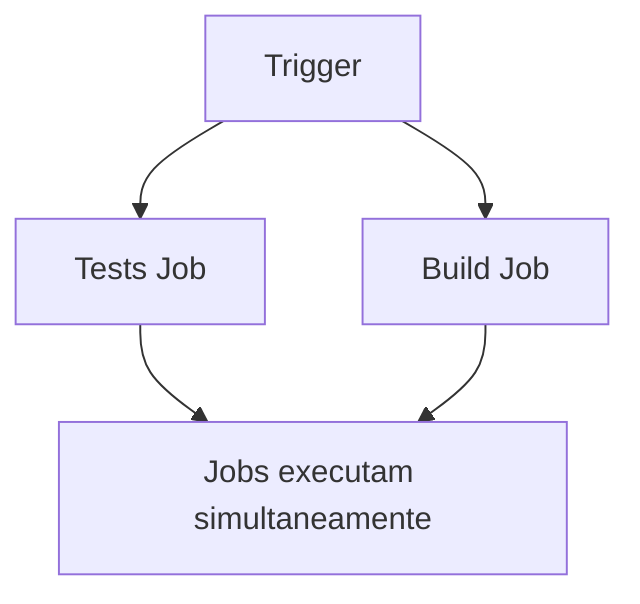

# 🚀 Pipeline CI/CD - Sistema de Notas Inatel

## 📋 Visão Geral

Pipeline automatizado implementado com GitHub Actions com foco nos jobs principais:

### ✅ Requisitos Implementados

- [x] **Execução dos testes** - Job `tests` (paralelo)
- [x] **Build e empacotamento** - Job `build` (paralelo) 
- [x] **Armazenamento de artefatos** - Pacotes e relatórios
- [ ] **Script de email** - A ser implementado pelo Lucca em job separado
- [x] **Paralelismo** - tests e build executam simultaneamente
- [x] **Instalação de software** - JDK e Maven via scripts

## 🏗️ Estrutura dos Jobs

### 1. 🧪 **Job: Tests** (Paralelo)
```yaml
Responsabilidades:
- Configuração do ambiente (JDK 21)
- Cache de dependências Maven
- Execução de testes unitários
- Execução de testes de integração
- Geração de relatórios de teste
- Armazenamento de artefatos de teste
```

**Artefatos gerados:**
- `test-reports` - Relatórios de teste em XML e HTML

### 2. 📦 **Job: Build** (Paralelo)
```yaml
Responsabilidades:
- Configuração do ambiente (JDK 21)
- Compilação do código
- Empacotamento em JAR
- Geração de informações de build
- Armazenamento de artefatos de build
```

**Artefatos gerados:**
- `application-package` - Arquivo JAR e classes compiladas
- `build-info` - Informações detalhadas do build

### 3. 📧 **Job: Notification** 
```yaml
Status: A ser implementado pelo Lucca
- Job de email separado
- Script de notificação personalizado
- Variáveis de ambiente para email
```

## 🔧 Configuração de Variáveis

### Variáveis de Ambiente Necessárias

No GitHub Actions (Settings > Secrets and Variables > Actions):

```yaml
# Obrigatórias para o job de email
EMAIL_TO: "destinatario@email.com"

# Opcionais (já configuradas automaticamente)
PIPELINE_STATUS: # Status da execução
BUILD_URL: # URL do build
COMMIT_SHA: # Hash do commit
BRANCH_NAME: # Nome da branch
```

## 🚀 Triggers do Pipeline

O pipeline é executado automaticamente em:

- **Push** para branches `main` ou `develop`
- **Pull Request** para branch `main`

## 📁 Artefatos Disponíveis

Após a execução, os seguintes artefatos ficam disponíveis por 30 dias:

1. **test-reports**
   - Relatórios de teste em XML
   - Relatórios HTML gerados pelo Surefire
   - Localização: `target/surefire-reports/` e `target/site/`

2. **application-package**
   - Arquivo JAR compilado
   - Classes compiladas
   - Localização: `target/*.jar` e `target/classes/`

3. **build-info**
   - Informações detalhadas do build
   - Versões de Java e Maven utilizadas
   - Hash do commit e branch

4. **email-script-template** (quando necessário)
   - Template do script de email
   - Estrutura para implementação

## 🔄 Paralelismo

O pipeline foi otimizado para execução em paralelo dos jobs principais:



- **Tests** e **Build** executam simultaneamente
- Reduz tempo total de execução
- Notification será implementado pelo Lucca em job separado

## 🛠️ Instalação de Software

O pipeline instala automaticamente:

- **JDK 21** (Temurin distribution)
- **Maven** (versão mais recente)
- **Dependências do projeto** (via cache)

## 📧 Implementação do Email (Para o Lucca)

### Arquivo: `scripts/sendEmail.sh`

O script já está estruturado e precisa apenas da implementação do envio real:

```bash
# Variáveis já disponíveis:
EMAIL_TO        # Email do destinatário
PIPELINE_STATUS # Status da execução
BUILD_URL       # URL do build
COMMIT_SHA      # Hash do commit
BRANCH_NAME     # Nome da branch
BUILD_DATE      # Data da execução
```

### Sugestões de Implementação:

1. **SendGrid API**
```bash
curl -X "POST" "https://api.sendgrid.com/v3/mail/send" \
     -H "Authorization: Bearer $SENDGRID_API_KEY" \
     -H "Content-Type: application/json" \
     -d '{...}'
```

2. **SMTP simples**
```bash
echo "Subject: Pipeline executado
To: $EMAIL_TO

Pipeline executado com status: $PIPELINE_STATUS" | sendmail $EMAIL_TO
```

3. **Webhook Discord/Slack**
```bash
curl -H "Content-Type: application/json" \
     -d '{"content":"Pipeline executado!"}' \
     $WEBHOOK_URL
```

## 🔍 Monitoramento

### Verificar Execução:
1. Acessar GitHub Actions na aba do repositório
2. Visualizar logs de cada job
3. Baixar artefatos gerados
4. Verificar relatórios de teste

### Debugging:
- Logs detalhados em cada step
- Informações de build salvas como artefato
- Cache de dependências para execuções mais rápidas

## ✅ Status de Implementação

- ✅ **Testes** - Funcionando completamente (paralelo)
- ✅ **Build** - Funcionando completamente (paralelo)
- ✅ **Artefatos** - Funcionando completamente  
- ✅ **Paralelismo** - Implementado entre tests e build
- ✅ **Instalação automática** - Implementado
- ⏳ **Email** - A ser implementado pelo Lucca

---

**Próximos passos:** Lucca deve criar job separado para notificação por email com as funcionalidades requeridas.